# BrandGate


A brand, and the pipeline that keeps generated output on it. Every surface below sits on a ground an image model made, under type and a mark that code laid down from `brand/tokens.json`, and none of it shipped until a gate written from the brand's own rules had scored it. The ones the gate refused are kept beside the ones it accepted, because a refusal you cannot see is a claim.

The brand is Handsel, a one-person software studio that keeps its tools in public. The rules it runs on are in [`brand/rules.md`](brand/rules.md), the sheet a designer would hand over is [`brand/guide.html`](brand/guide.html), and the site is [handsel-lovat.vercel.app](https://handsel-lovat.vercel.app).

## The surfaces

| | accepted | refused |
|---|---|---|
| [hero](surfaces/hero/) |  pass 0.99 | 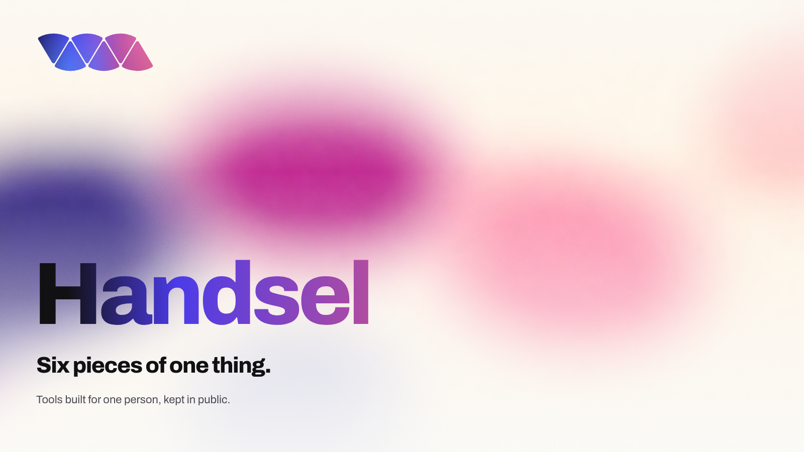 flat magenta at 6.8 percent; then the wordmark over that magenta at 1.6:1 |
| [square](surfaces/social/) | 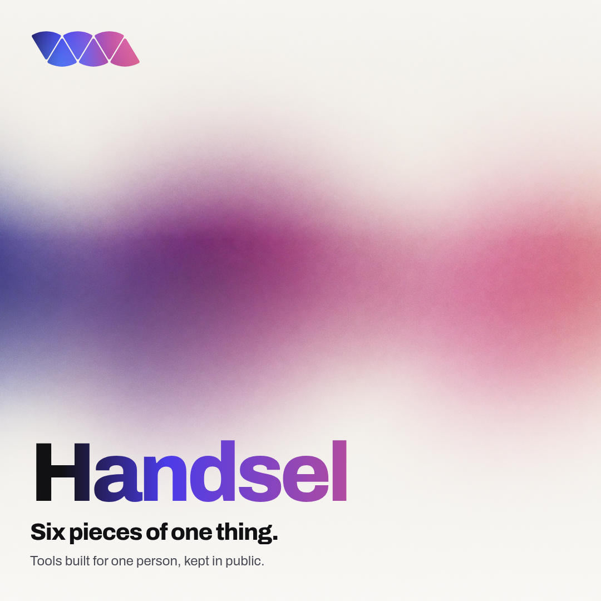 pass 0.99 | 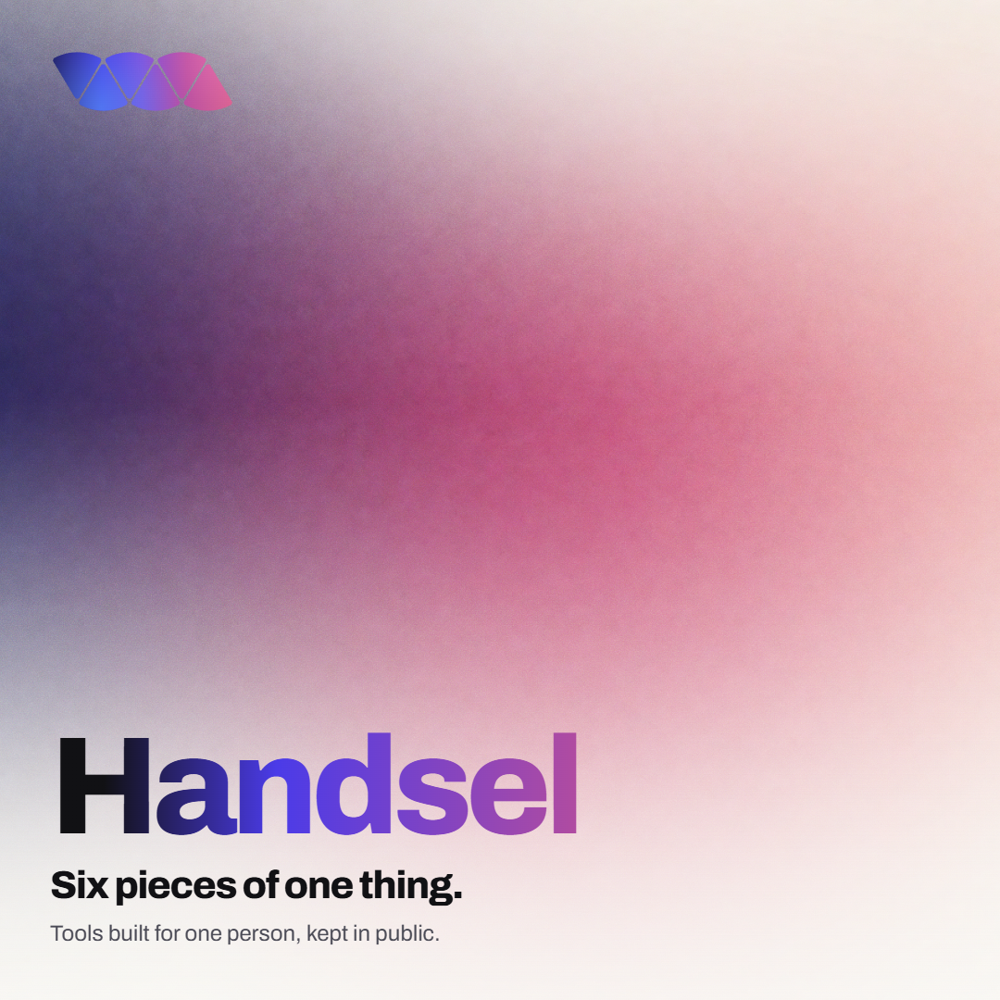 the orbs separate, no bleed |
| [story](surfaces/social/) |  pass 1.00 | 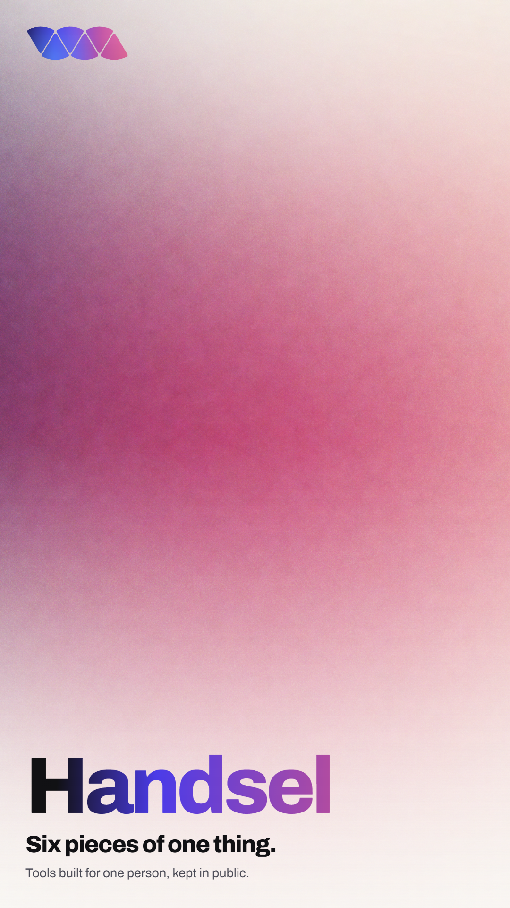 same ground; the band shrinks the fault and the card itself passes |
| [OG](surfaces/social/) | 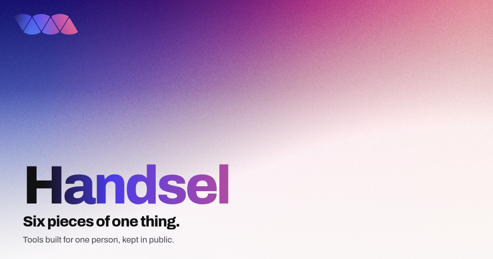 pass 0.97 | 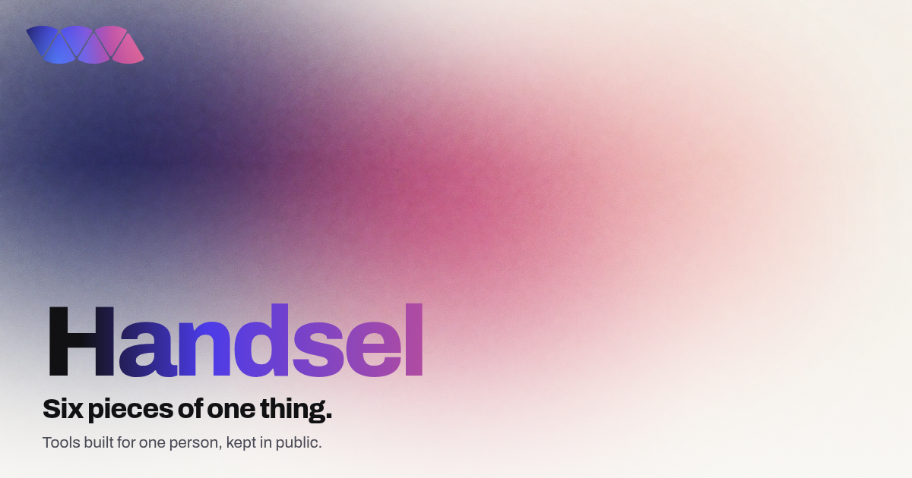 the orbs separate, no bleed |
| [print, A4](surfaces/print/) | 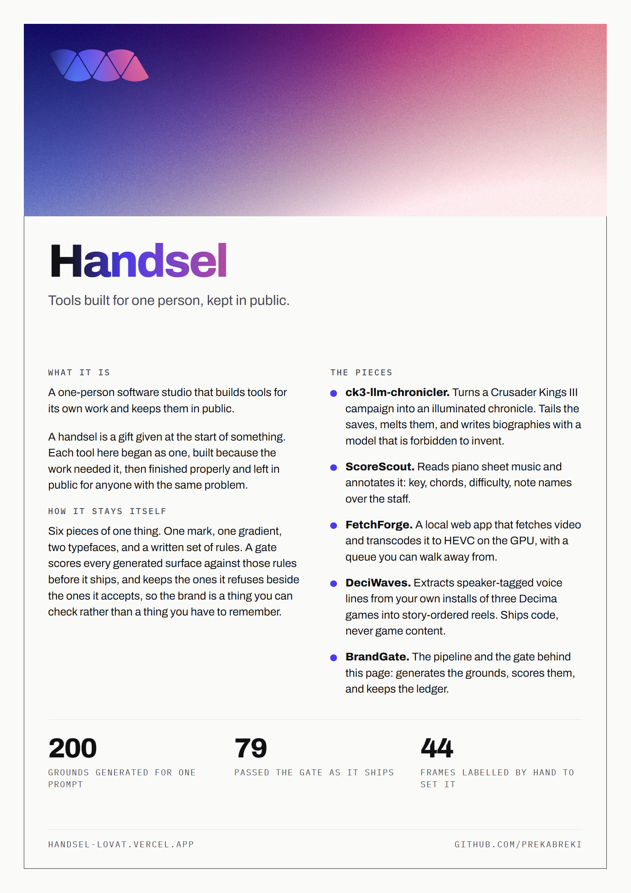 pass 1.00 | 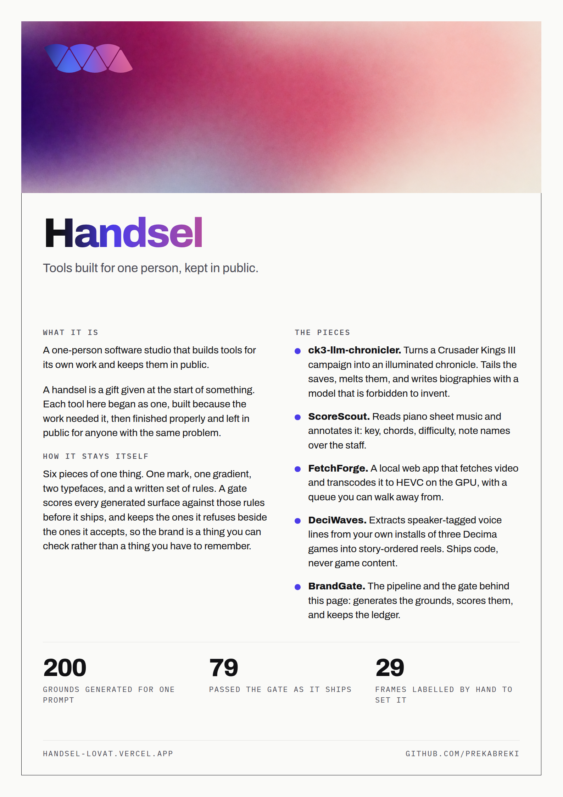 flat magenta; a band of it on A4 passes the page |

The recipe is the same on every row: ground, paper veil, grain where the rules allow it, the mark, the wordmark in the text gradient, a headline in ink. What changes between a hero and a story card is one row of numbers in a table. Where the numbers came from is worth saying. The square's crop was scored at six positions across the ground and passes at two of them; no 9:16 crop of a 16:9 ground passes at all, so the story carries its ground as a band. The gate chose those, not an eye, and the comment above the table says which verdicts it was.

## The sameness run

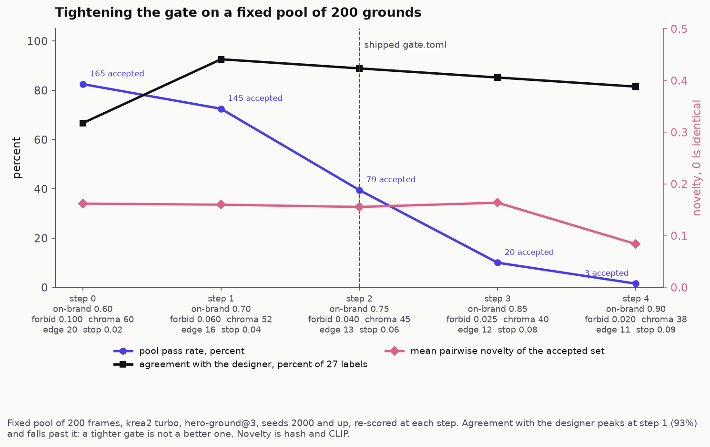

"Reliably" cuts both ways. A gate can be tightened until nothing new survives, and no pass rate will show it, because a gate that only accepts near copies of what it already knows can be tuned to accept them every time. So two hundred grounds from one prompt were generated once and re-scored at five threshold sets, loose to tight. The pass rate falls from 165 accepted to three. The survivors' pairwise novelty holds around 0.16 for four steps and halves at the last, which is the flat line arriving: three frames alike, if still tellable apart by eye. And agreement with the designer's 27 labelled frames peaks one step looser than the shipped gate, then falls. That third line is the point. Past the peak, every notch tighter buys a smaller, samer accepted set and a gate that agrees with its designer less. The bar stays where it ships; one frame in 27 is not a reason to move it, and the next labelled batch decides. The five threshold sets are in [`runs/sameness/steps.md`](runs/sameness/steps.md).

## From a personal tool to a pipeline

`pipeline/gen.py` started as one file for driving a local ComfyUI: a growing pile of argparse flags and a provenance log that wrote two lines per run so a power cut still left the recipe on disk. It knew a lot about one person's habits. Depth exports, region-masked detail passes, img2img at half a dozen scales and six model families, each needed once on a Tuesday and never removed. It also assumed it lived inside the ComfyUI checkout, which is how it got away with never deciding where a frame should land.

Three things made it a module. It was carved down rather than copied: text-to-image only, and only the two model families the brand uses, because a generator with six backends and no reason for any of them is a drawer. Frames come back over the server's HTTP API and land in this repo, so the pipeline and the weights no longer share a directory and the path in a ledger row is a path that exists here. And the prompt moved out of the command line into `brand/prompts/*.md`, versioned, so the words that produced a frame are a thing you can cite.

The ledger, `runs/ledger.jsonl`, is one line per run: model, tier, prompt at its exact version, seed, resolved sampler settings, path, latency. Failures get a row too, with the error and no path. It exists because every later claim in this repo is a claim about a distribution, and the gate can only be calibrated against frames whose scores sit next to the prompt version that produced them. `cost_usd` is null on every row, and that is a recorded fact rather than a gap: the hardware is already owned, and inventing a per-frame price would quietly turn the scorecard into fiction.

## The ident

| accepted | refused |
|---|---|
| [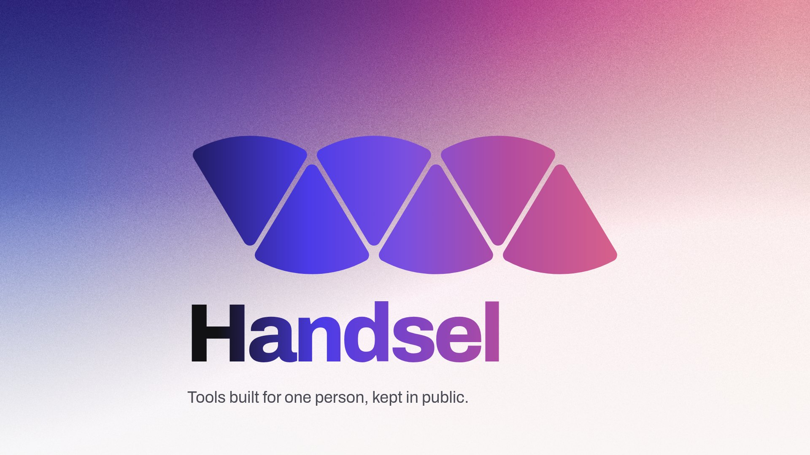](surfaces/motion/out/ident.mp4) | [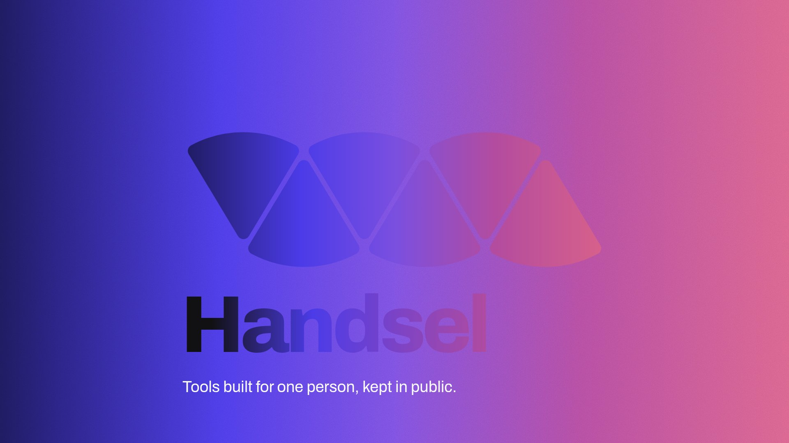](surfaces/motion/out/refused/ident.mp4) |
| the accepted ground under a tenth of paper, `ident.html` | the flow itself as the ground, `ident.html?ground=ramp` |
| **pass, 6 of 6 frames, on-brand 0.98** | **fail, 6 of 6 frames, on-brand 0.72 to 0.83**, colour.01 and gradient.03 on every frame, the tagline's contrast too as it lands |
| soft wash: darks at chroma 51 | the ground is #8751AA, 63 from the nearest allowed ground; the darks are saturated (chroma 78 to 80, a wash stays under 56) |

Six seconds, 1920 by 1080, drawn in code from the mark's own geometry and the motion rules: a rise on a soft curve, staggered 120 ms, the flow left to right, nothing rotated or mirrored. `surfaces/motion/ident.html` takes `?t=<ms>` and seeks its timeline there, and `surfaces/motion/render.py` captures 180 held frames that way, because Chrome's virtual time advances timers without producing frames and a recording of a playing page is a file of the right length holding the wrong pictures. ffprobe confirms the frame count before the file is kept. One frame a second goes through the gate with its foreground declared, the way every surface is scored; the series is in `surfaces/motion/out/score.json`.

The refused cut is the first thing anyone does with a gradient brand: put the flow behind the mark. `brand/rules.md` forbids it by name, "never the raw ramp", and the frame shows why the sentence exists: the six slices vanish into their own colours, and the wordmark's ink-to-flow gradient has nothing to turn against. The gate refuses it on two rules on every sampled frame, the ground colour and the wash, and the same 180 frames were drawn again over it. `render.py --variant ramp` regenerates it into `surfaces/motion/out/refused/`, score series included, because a refusal you cannot play is a claim. Two weaker refusals from the same evening are kept in `ident.html` as `?ground=orbs` and `?ground=thin`; the orbs one failed the wash at chroma 62 to 64 but by eye read the same as the accepted frame, which is not a refusal anyone can see.

## Working with a designer

[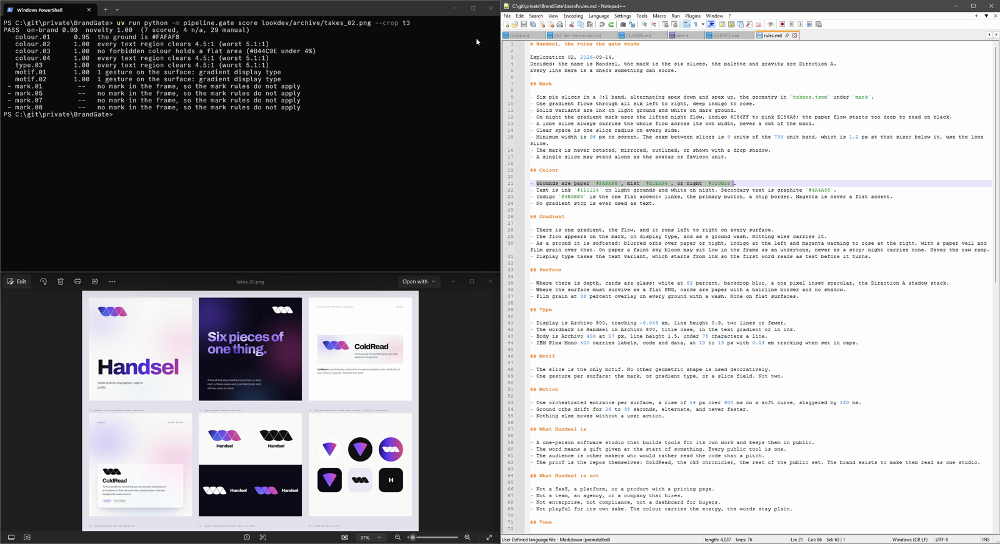](docs/rule-edit.mp4)

The rules are prose, and the gate reads the prose. Delete "paper" from the line that names the grounds and take 3's ground rule drops from 0.95 to 0.79, with the reason changing from "the ground is #FAFAF8" to "the ground is #ECEAF6"; delete mist as well and it fails. A designer edits a sentence and the score moves, which is the whole arrangement: the designer owns the words, the gate owns the arithmetic, and neither has to learn the other's tool. How the bars were set, from 27 frames the designer labelled by hand, and which eight of those the gate still disagrees with, is in [`docs/calibration.md`](docs/calibration.md).

## Run it

```bash
python -m pipeline.gen --prompt hero-ground --seed 1                 # one ground, one ledger row
python -m pipeline.gate score surfaces/hero/accepted/hero.png        # score anything
python -m surfaces.hero.compose --ground <png> --out surfaces/hero/accepted
python -m surfaces.social.compose --ground <png> --out surfaces/social/accepted
python -m surfaces.print.compose --ground <png> --out surfaces/print/accepted
python -m runs.sameness --pool surfaces/_pool --steps 5
uv run --with pytest pytest -q
```

The backend is a local ComfyUI at `COMFY_SERVER` (default `http://127.0.0.1:8188`), models Krea-2 and Flux.2, a turbo tier for hunting and a raw tier for finals. The pool and the calibration frames are regenerable from the ledger's seeds and are not in the repo; the labels are.
