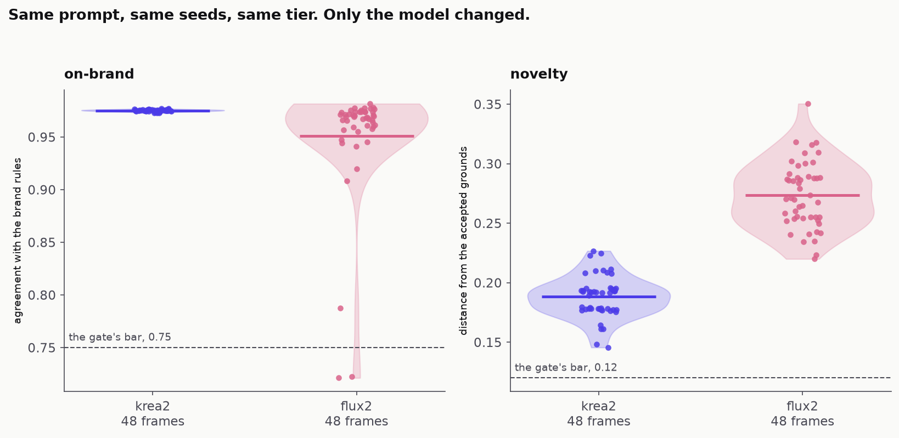

# BrandGate


A brand, and the pipeline that keeps generated output on it. Every surface below sits on a ground an image model made, under type and a mark laid down from `brand/tokens.json`, and nothing shipped until a gate written from the brand's own rules had scored it. Refused candidates are kept beside accepted ones, because a refusal you cannot see is a claim.

Handsel is invented, so the rules are mine to write and mine to be wrong about: [`brand/rules.md`](brand/rules.md), the designer's sheet at [`brand/guide.html`](brand/guide.html), the site at [handsel-lovat.vercel.app](https://handsel-lovat.vercel.app).

## The surfaces

| | accepted | refused |
|---|---|---|
| [hero](surfaces/hero/) |  pass 0.99 |  the wash is dull, mean chroma 27 where a ground carries at least 30 |
| [square](surfaces/social/) |  pass 0.98 |  the wash is dull, and composed the ground reads a rose-grey no rule allows |
| [story](surfaces/social/) |  pass 0.99 |  same ground; the band loses indigo from the wash entirely |
| [OG](surfaces/social/) |  pass 0.98 |  the wash is dull, mean chroma 26 |
| [print, A4](surfaces/print/) |  pass 1.00 |  the page passes, its ground does not: dull wash, mean chroma 27, refused before the page was laid |

The recipe is the same on every row; what changes between a hero and a story card is one line of numbers. The square's crop was scored at six positions across its ground and passes at two, and no 9:16 crop of a 16:9 ground passes at all, so the story carries its ground as a band. The gate chose those, not an eye.

## The drift run



Swap the model and hold everything else: same prompt at the same version, the same forty-eight seeds, same tier, same size. krea2 passes 96 percent at a mean of 0.9751 with a standard deviation of 0.0010, which is a flat line. flux2 passes 54 percent at 0.9511, and that two-hundredth of a point of mean hides a spread fifty-six times wider. The brand did not get worse on average, it got unreliable, and a team watching the mean would have shipped the swap.

The hollow rings are the point. A frame fails when any single rule fails, whatever its score, so most of flux2's refusals sit at 0.94 to 0.97, well clear of the bar. One rule did nearly all of it: `gradient.03`, twenty-one frames against krea2's two, saying the orbs separate at steepest edges 15.2 where a bleed stays under 14. Every figure in [`runs/drift/scorecard.md`](runs/drift/scorecard.md) is read from the run's output or the ledger, never typed. The same gate runs in CI, where [`gate.yml`](.github/workflows/gate.yml) fails the job when a shipped surface stops passing.

## The sameness run


A gate can also be tightened until nothing new survives, and no pass rate will show it, because a gate that accepts only near copies of what it knows can be tuned to accept them every time. Two hundred grounds, generated once and re-scored at five threshold sets: the pass rate falls from 165 to three, and the survivors' pairwise novelty holds near 0.16 for four steps then halves, which is the flat line arriving. Agreement with the designer's 27 labelled frames peaks one step looser than the shipped gate, then falls, so the bar stays where it ships.

## From a personal tool to a pipeline

`pipeline/gen.py` started as one file for driving a local ComfyUI, and it knew a lot about one person's habits: depth exports, region-masked detail passes, img2img at half a dozen scales, six model families, each needed once on a Tuesday and never removed. It assumed it lived inside the ComfyUI checkout, which is how it got away with never deciding where a frame should land.

Three things made it a module. It was carved down rather than copied, to text-to-image and the two model families the brand uses, because a generator with six backends and no reason for any of them is a drawer. Frames now come back over the server's HTTP API into this repo. And the prompt moved out of the command line into versioned `brand/prompts/*.md`, so the words that produced a frame are a thing you can cite.

The ledger, [`runs/ledger.jsonl`](runs/ledger.jsonl), is one line per run: model, tier, prompt at its exact version, seed, sampler settings, path, latency, and a row for failures too. Every claim here is a claim about a distribution, and a distribution is worth nothing if you cannot say which prompt version produced it. `cost_usd` is null on every row, recorded rather than left blank, because inventing a per-frame price on owned hardware would turn the scorecard into fiction.

## The ident

| accepted | refused |
|---|---|
| [](surfaces/motion/out/ident.mp4) | [](surfaces/motion/out/refused/ident.mp4) |
| the accepted ground under a tenth of paper, `ident.html` | the flow itself as the ground, `ident.html?ground=ramp` |
| **pass, 6 of 6 frames, on-brand 0.98** | **fail, 6 of 6 frames, on-brand 0.72 to 0.82**, colour.01 and gradient.03 on every frame, the tagline's contrast too as it lands |
| soft wash: darks at chroma 51 | the ground is #8751AA, 63 from the nearest allowed ground; the darks are saturated (chroma 78 to 80, a wash stays under 56) |

Six seconds at 1920 by 1080, drawn in code from the mark's own geometry. `ident.html` takes `?t=<ms>` and seeks its timeline there, and `render.py` captures 180 held frames that way, because Chrome's virtual time advances timers without producing frames: a recording of a playing page is a file of the right length holding the wrong pictures. The first cut lost four frames of 180 to a CDN import that had not run, which is why every frame now carries a readiness marker.

The refused cut is the first thing anyone does with a gradient brand: put the flow behind the mark. `brand/rules.md` forbids it by name, "never the raw ramp", and the gate refuses it on two rules on every sampled frame. The same 180 frames were drawn again over it, because a refusal you cannot play is a claim.

## Working with a designer

[](docs/rule-edit.mp4)

The rules are prose, and the gate reads the prose. Delete "paper" from the line naming the grounds and take 3's ground rule drops from 0.95 to 0.79, the reason changing to "the ground is #ECEAF6"; delete mist too and it fails. A designer edits a sentence and the score moves. The designer owns the words, the gate owns the arithmetic, and neither has to learn the other's tool. Which eight of 27 labelled frames the gate still disagrees with is in [`docs/calibration.md`](docs/calibration.md).

## Run it

```bash
python -m pipeline.gen --prompt hero-ground --seed 1                 # one ground, one ledger row
python -m pipeline.gate score surfaces/hero/accepted/hero.png        # score anything
python -m surfaces.hero.compose --ground <png> --out surfaces/hero/accepted
python -m surfaces.social.compose --ground <png> --out surfaces/social/accepted
python -m surfaces.print.compose --ground <png> --out surfaces/print/accepted
python -m runs.sameness --pool surfaces/_pool --steps 5
uv run --with pytest pytest -q
```

The backend is a local ComfyUI, Krea-2 and Flux.2, a turbo tier for hunting and a raw tier for finals. Pools and calibration frames regenerate from the ledger's seeds and are not tracked; the labels are.
